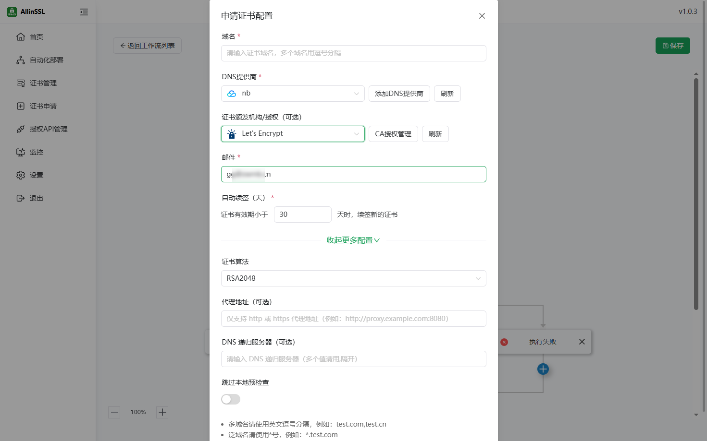

# 申请证书使用指南

请先添加上对应的dns提供商

**注意！！！**
**请确保填写的域名在选择的dns提供商账号下，且账号具有修改dns权限，否则可能申请失败！！！**

*   **域名:** SSL证书包含的域名（多个域名用英文逗号隔开）
*   **DNS提供商:** 选择域名对应的DNS提供商
*   **证书颁发机构:** 选择证书颁发机构（默认Let's Encrypt），部分其它机构（如zerossl）可能需要EAB密钥请先添加对应的CA授权
*   **自动续签:** 在证书有效期达到设定值前复用之前的证书
*   **证书算法:** 选择加密算法（默认RSA2048，没有特殊要求用默认即可）
*   **代理地址:** http代理地址，申请证书因为网络超时导致失败时可尝试配置代理后申请
*   **DNS递归服务器:** 本地预检查使用的DNS服务器（没有特殊要求用默认即可）
*   **跳过本地预检查:** 是否跳过本地验证
