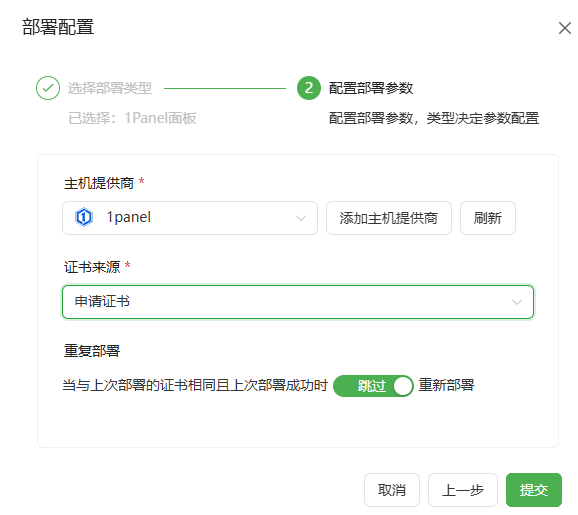
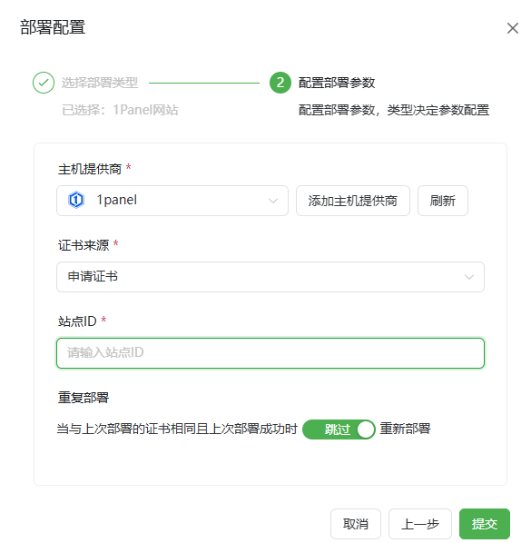
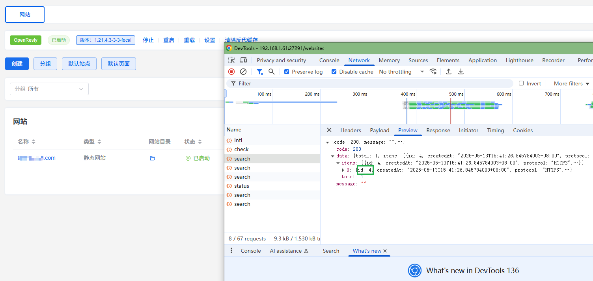

# 1Panel部署平台使用指南

**使用前请先配置对应的1Panel API供应商[1Panel API设置教程](/guide/help/provider/btpanel)**

## 1Panel面板SSL

**注意！！！**
**请确保证书适用于面板所绑定的域名 否则将无法通过HTTPS访问面板！！！**

*   **主机供应商:** 选择对应的供应商。
*   **证书来源:** 根据工作流中申请的实际证书来选择。
*   **重复部署 (可选):** 当上次部署成功后本次证书与上次证书相同时是否跳过执行部署流程。

## 1Panel网站

*   **主机供应商:** 选择对应的供应商。
*   **证书来源:** 根据工作流中申请的实际证书来选择。
*   **站点ID(Site Id):** 站点的对应ID（在后续版本会优化该处，变成下拉框选择）。
*   **重复部署 (可选):** 当上次部署成功后本次证书与上次证书相同时是否跳过执行部署流程。

**站点ID获取方式** 
目前需要进行手动抓包获取
- 1.进入1panel网站列表，搜索一下对应的站点后选择search接口查看对应的ID）
- 2.按F12打开开发者工具，选择NetWork(网络)
- 3.在网站列表中进行搜索需要添加的站点
- 4.在新弹出的search中找到需要添加的站点ID

