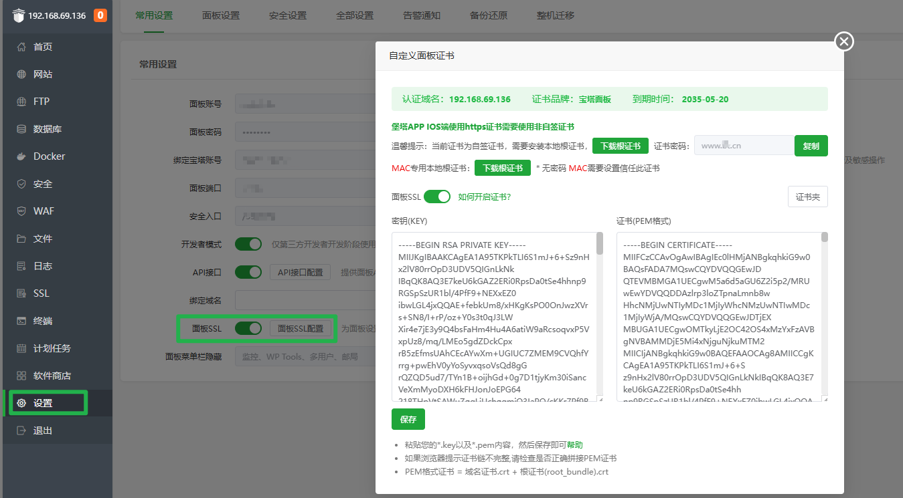

# 宝塔面板部署平台使用指南

**使用前请先配置对应的宝塔面板API供应商[宝塔面板API](/guide/help/provider/btpanel)**

## 宝塔面板SSL

**注意！！！**
**请确保证书适用于宝塔面板所绑定的域名 否则将无法通过HTTPS访问面板！！！**

*   **主机供应商:** 选择对应的供应商。
*   **证书来源:** 根据工作流中申请的实际证书来选择。
*   **重复部署 (可选):** 当上次部署成功后本次证书与上次证书相同时是否跳过执行部署流程。

**证书部署后可以在此看到**

## 宝塔面板网站

*   **主机供应商:** 选择对应的供应商。
*   **证书来源:** 根据工作流中申请的实际证书来选择。
*   **网站名(Site Name):** 可供选择对应需要部署的网站，支持多选。
*   **重复部署 (可选):** 当上次部署成功后本次证书与上次证书相同时是否跳过执行部署流程。

## 宝塔Docker站点

**由于宝塔面板普通网站和Docker网站的并不相通所以需要单独设置。** 
**适用于宝塔面板中Docker内的网站**

*   **主机供应商:** 选择对应的供应商。
*   **证书来源:** 根据工作流中申请的实际证书来选择。
*   **网站名(Site Name):** 输入需要部署SSL网站的网站名（上图列表中第一列）。
*   **重复部署 (可选):** 当上次部署成功后本次证书与上次证书相同时是否跳过执行部署流程。