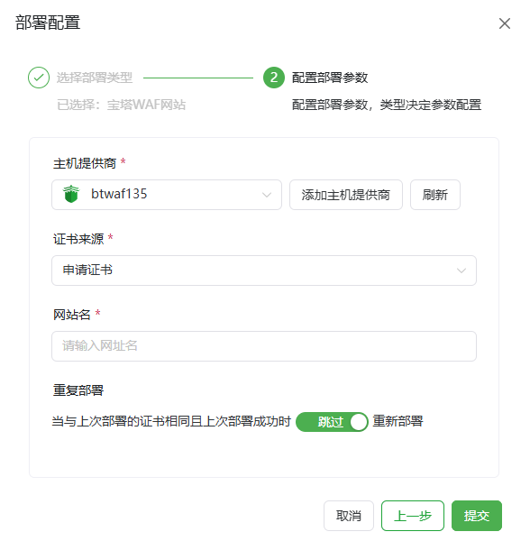
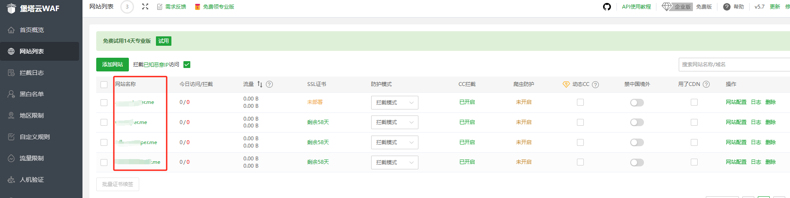

# 宝塔WAF部署平台使用指南

**使用前请先配置对应的宝塔WAF API供应商[宝塔WAF API](/guide/help/provider/btwaf)**

*   **主机供应商:** 选择对应的供应商。
*   **证书来源:** 根据工作流中申请的实际证书来选择。
*   **网站名(Site Name):** 输入需要部署证书网站的网站名称（上图列表中第一列）。
*   **重复部署 (可选):** 当上次部署成功后本次证书与上次证书相同时是否跳过执行部署流程。
