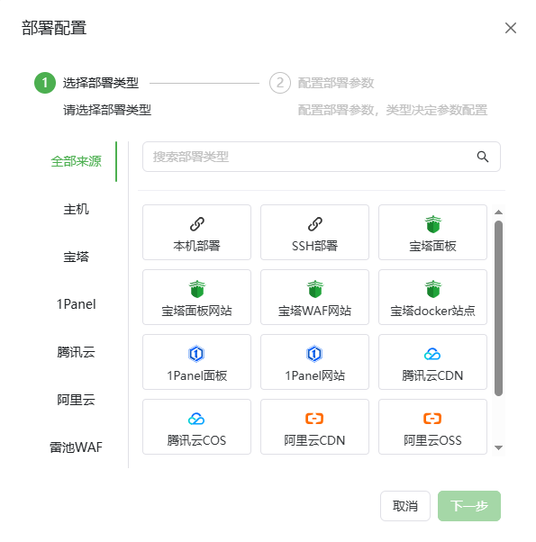

# 部署平台使用指南

**部署平台中提供了多家的供应商** 
**大致包括如下几种类型**
- **常用云厂商CDN。**
- **常用云厂商对象存储。**
- **常见建站面板的网站、面板主体证书。**
- **常见WAF的网站、WAF主体证书。**

`在未来我们将会持续添加各类云厂商，如果希望添加你所使用的云厂商可以加入官方QQ群或在GitHub Issue区中提出！` 
**使用前请先配置对应的供应商[供应商配置教程](/guide/help/provider/index)**