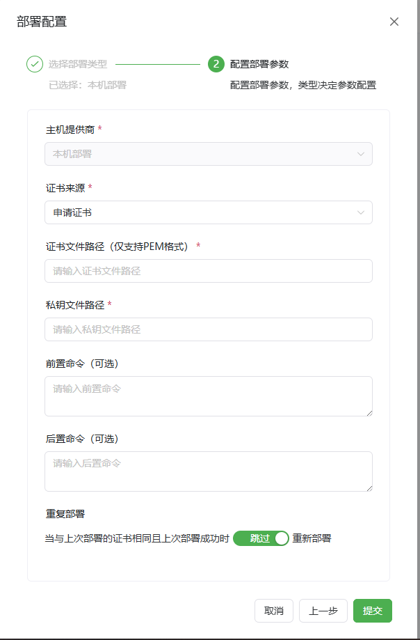

# 本地部署使用指南

**如果你使用的是Docker安装的AllinSSL 该方式可能需要特殊配置 否则将无法正确部署！！！**
**在创建AllinSSL时需要将部署目录挂载至容器内！**
```
-v /www/allinssl/cert1:/cert
```
`将/www/allinssl/cert 挂载至容器中的/cert`
`后续证书路径填写/cert/key.pem时 将会在主机中的/www/allinssl/cert/key.pem下生效`

**如果你是正常部署 请忽略上述**



*   **主机供应商:** 选择对应的供应商。
*   **证书来源:** 根据工作流中申请的实际证书来选择。
*   **证书文件路径(cert):** 证书文件的全路径需要具体到文件名。
*   **私钥文件路径(key):** 证书私钥文件的全路径需要具体到文件名。
*   **前置命令 (可选):** 部署证书前所执行的命令，可根据实际需求所选（备份旧证书或其他操作）。
*   **后置命令 (可选):** 部署证书完成后所执行的命令，可根据实际需求所选（重载服务等）。
*   **重复部署 (可选):** 当上次部署成功后本次证书与上次证书相同时是否跳过执行部署流程。