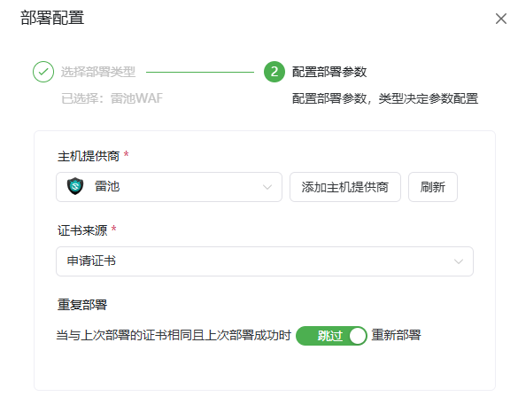
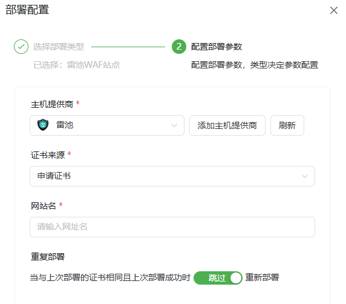
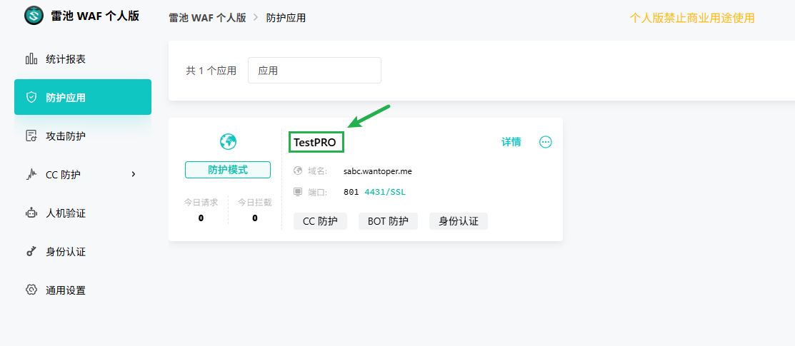

# 雷池WAF部署平台使用指南

**使用前请先配置对应的雷池WAF API供应商[雷池WAF API](/guide/help/provider/safeline)**

## 雷池面板

**请确保证书适用于雷池WAF面板所绑定的域名 否则将无法通过HTTPS访问面板！！！**

*   **主机供应商:** 选择雷池WAF类型的供应商。
*   **证书来源:** 根据工作流中申请的实际证书来选择。
*   **重复部署 (可选):** 当上次部署成功后本次证书与上次证书相同时是否跳过执行部署流程。

## 雷池网站

**网站名如下图处所指**

*   **主机供应商:** 选择雷池WAF类型的供应商。
*   **证书来源:** 根据工作流中申请的实际证书来选择。
*   **网站名(Site Name):** 输入需要部署证书的防护应用名称（上图中箭头所指处）。
*   **重复部署 (可选):** 当上次部署成功后本次证书与上次证书相同时是否跳过执行部署流程。

**若当前应用未部署证书 则将证书上传至雷池WAF后不会自动应用至网站 请手动应用至网站 下次运行时会自动更新**
**若当前应用已署证书 则将应用旧证书自动更新为新证书**