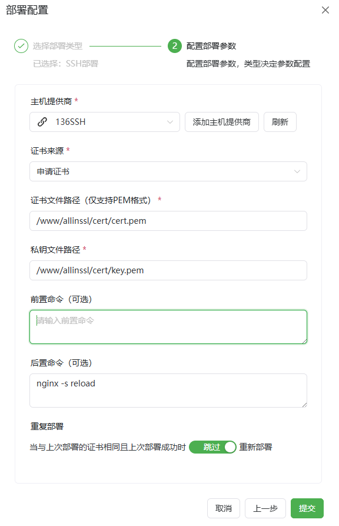

# SSH部署平台使用指南

**使用前请先配置对应的SSH供应商[SSH配置教程](/guide/help/provider/ssh)**

*   **主机供应商:** 选择对应的供应商。
*   **证书来源:** 根据工作流中申请的实际证书来选择。
*   **证书文件路径(cert):** 证书文件的全路径需要具体到文件名。
*   **私钥文件路径(key):** 证书私钥文件的全路径需要具体到文件名。
*   **前置命令 (可选):** 连接上SSH，部署证书前所执行的命令，可根据实际需求所选（备份旧证书或其他操作）。
*   **后置命令 (可选):** 连接上SSH，部署证书完成后所执行的命令，可根据实际需求所选（重载服务等）。
*   **重复部署 (可选):** 当上次部署成功后本次证书与上次证书相同时是否跳过执行部署流程。