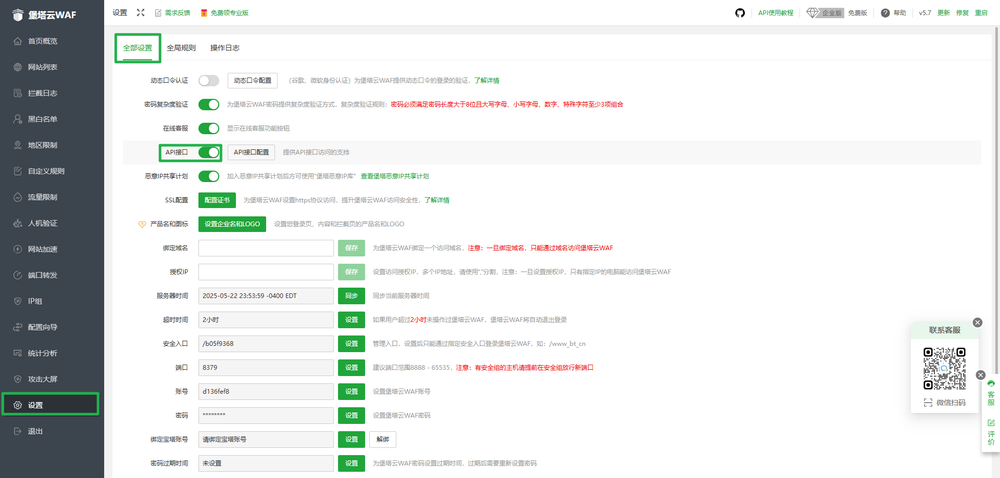
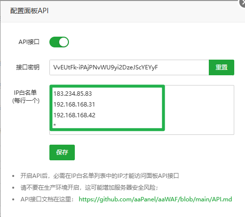
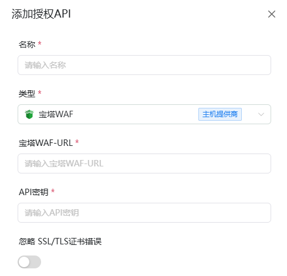

# 宝塔WAFAPI接口获取指南

## 1.打开宝塔WAF API
**进入宝塔WAF后按照以下步骤打开API接口**

**`1.点击左侧设置`**

**`2.点击全部常用设置`**

**`3.点击API接口打开按钮`**

## 2.配置宝塔WAF API
**按照第一步打开API后点击API接口配置**

**`1.将ALLinSSL面板的IP填至IP白名单中`**

**`2.复制接口密钥`**

**`3.点击保存`**

## 3.添加至AllinSSL

- **宝塔WAF-URL**：    宝塔WAF上方浏览器的地址+端口 例如 `https://192.168.69.136:5555/`
- **API密钥**：         第二步中复制的接口密钥 例如 `W4X7Wxxxxxxxxxxxxxxxx0aaDFLAO`
- **对于自签的IP证书 建议打开忽略SSL/TLS证书错误**