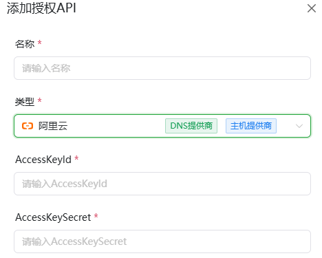

# 授权 API 管理 (API Key Management)

此页面用于管理 ALLinSSL 与其他服务交互所需的凭证和 API 密钥。例如，申请证书时需要 DNS 提供商的 API 密钥进行域名验证，部署证书时可能需要服务器的 SSH 凭证、云平台的 API 密钥或面板的接口密钥。

集中管理这些授权信息可以避免在多个工作流中重复输入，并提高安全性。

## API 授权列表

*   **添加后可以点测试按钮进行API验证**

## 阿里云
*   获取请参考阿里云官方[用户手册](https://help.aliyun.com/zh/ram/user-guide/create-an-accesskey-pair)。 

*   **AccessKeyId:** 阿里云 RAM 用户的 AccessKey ID。
*   **AccessKeySecret:** 对应的 AccessKey Secret。
    *   **权限建议:** 为了安全，建议创建一个拥有所需最小权限（例如 DNS 管理 `AliyunDNSFullAccess`，CDN 管理 `AliyunCDNFullAccess`，WAF 管理相关权限等）的 RAM 用户，并使用其 AK/SK。

## 腾讯云
-   获取请参考腾讯云官方[用户手册](https://cloud.tencent.com/document/product/598/40488)。 

*   **SecretId:** 腾讯云 CAM 用户的 Secret ID。
*   **SecretKey:** 对应的 Secret Key。
    *   **权限建议:** 同阿里云，建议创建拥有最小所需权限（例如 DNSPod 管理 `QcloudDNSPodFullAccess`，CDN 管理 `QcloudCDNFullAccess`，WAF 管理相关权限等）的 CAM 子用户，并使用其凭证。

## 百度云
-   获取请参考百度云官方[用户手册](https://cloud.baidu.com/doc/Reference/s/9jwvz2egb)。 

*   **AccessKey:** 百度云用户的AccessKey。
*   **SecretKey:** 对应的 SecretKey。

## 华为云
-   获取请参考华为云官方[用户手册](https://support.huaweicloud.com/usermanual-ca/ca_01_0003.html)。 

*   **AccessKey:** 华为云用户的AccessKey。
*   **SecretKey:** 对应的 SecretKey。

## 七牛云
-   获取请参考七牛云官方[用户手册](https://developer.qiniu.com/af/kb/1479/how-to-access-or-locate-the-access-key-and-secret-key)。 

*   **AccessKey:** 七牛云用户的AccessKey。
*   **SecretKey:** 对应的 Secret Key。

## 火山引擎
-   获取请参考火山引擎官方[用户手册](https://www.volcengine.com/docs/6291/65568)。 

*   **AccessKey:** 火山引擎用户的AccessKey。
*   **SecretKey:** 对应的SecretKey。

## Cloudflare
-   获取请参考Cloudflare官方[用户手册](https://developers.cloudflare.com/fundamentals/api/get-started/keys/)。 
-   登陆后点击账号头像，进入 `我的个人资料`>`API 令牌`>`创建令牌`，选择使用`编辑区域 DNS`模板,根据实际需要配置对应的权限。

*   **邮箱:** Cloudflare账户所绑定的邮箱。
*   **APIKey:** 所生成的APIKey。

## GoDaddy
-   获取请参考GoDaddy官方[用户手册](https://developer.godaddy.com/getstarted)。 
-   登陆后打开https://developer.godaddy.com 点击 `API Key Management`>`Create New API Key`>`Environment选择Production`>`Next`，复制KEY和Secret。

*   **API KEY:** 对应用户的KEY。
*   **API Secret:** 所生成的Secret。

## (后续将会支持会更多)
*   **其他 DNS 提供商:** (根据支持情况添加)

添加完成后，这些授权信息就可以在自动化部署流水线的"申请 SSL"和"部署 SSL"节点中被选择使用。
