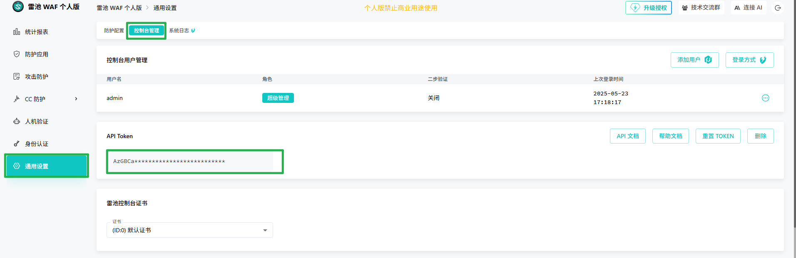
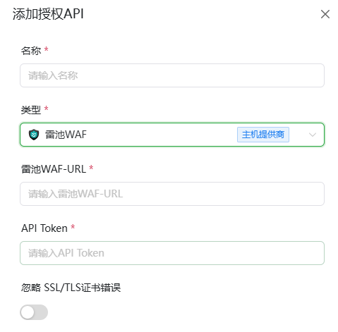

# 雷池WAFAPI接口获取指南

## 1.打开雷池WAF API
**进入雷池WAF后按照以下步骤打开API接口**

**`1.点击左侧通用设置`**

**`2.点击控制台管理`**

**`3.复制API Token`** 
*   如果还未创建请先生成API Token
*   若已创建并且忘记了可以选择重置Token

## 2.添加至AllinSSL

- **雷池WAF-URL**：    雷池WAF上方浏览器的地址+端口 例如 `https://192.168.69.136:5555/`
- **API Token**：      第一步中复制的接口密钥 例如 `W4X7Wxxxxxxxxxxxxxxxx0aaDFLAO`
- **对于自签的IP证书 建议打开忽略SSL/TLS证书错误**