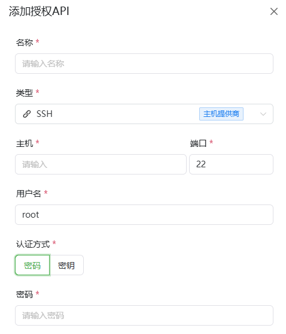

# SSH接口指南

*   **主机(Host IP):** 目标服务器的 IP 地址或域名。
*   **SSH 端口 (Port):** SSH 连接端口（默认填充 22）。
*   **用户名 (Username):** 登录服务器的用户名（默认填充 root）。
*   **验证类型 (Authentication Type):**
    *   **密码 (Password):** 直接输入登录密码。
    *   **SSH 密钥 (SSH Key)(可选):** 如果你的私钥设置了密码保护，在此输入。